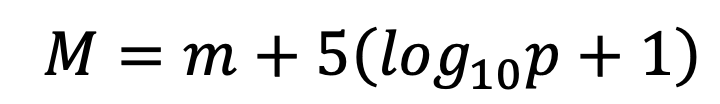
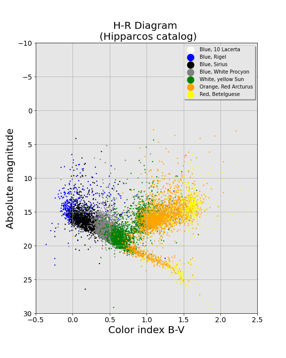
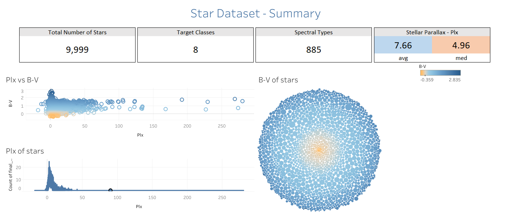
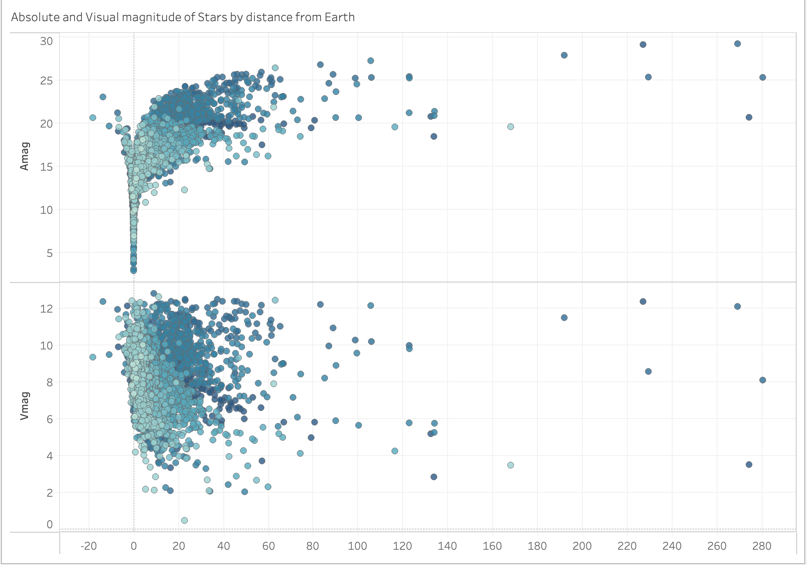
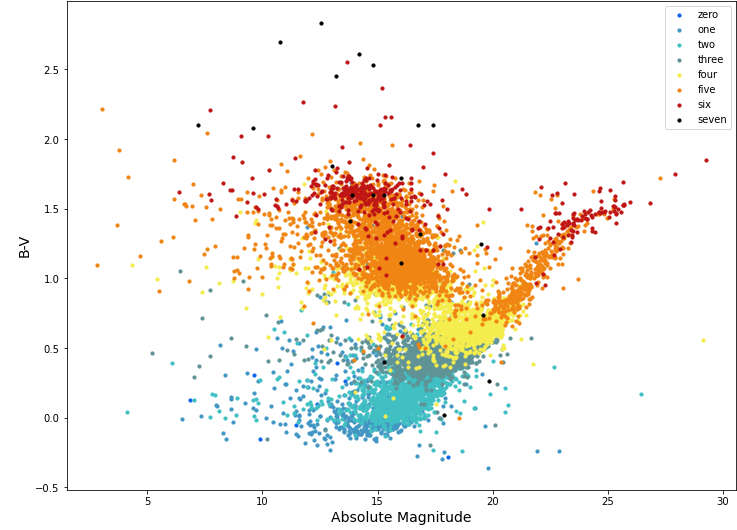
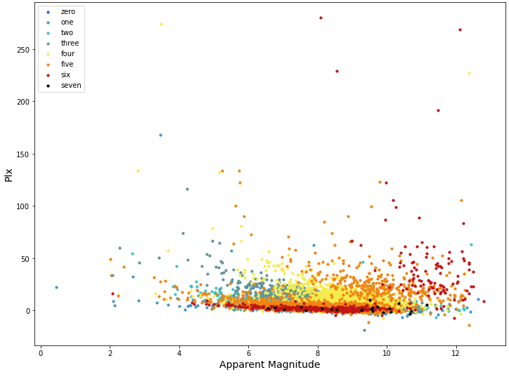

# Project 4: Mission Meteor

DAV Module 23 - Project 4 Group Challenge: Demystifying Machine Learning

## Introduction

Welcome to our project focused on the classification of stars through the use of machine learning. In this project, we look to develop models that can accurately categorise stars into their respective classes, using a variety of data analysis techniques and tools. We will also use Tableau to create visual analyses of our datasets.

After forming our group and gathering together, we searched for various datasets across different categories, mainly using Kaggle and Google searches to find our dataset. We came to a general consensus on analysing the [Kaggle Dataset - Star Dataset for Stellar Classification](https://www.kaggle.com/datasets/vinesmsuic/star-categorization-giants-and-dwarfs):

* [Star Data - Raw Small](Resources/Star9999_raw.csv)
* [Star Data- Raw Large](Resources/Star99999_raw.csv)

The aim of this study is to utilise the Morgan-Keenan (MK) classification system, which incorporates the HR classification system, to categorise stars by their chromaticity and size using spectral data. The study will focus on categorising stars into the main Spectral Types using the Absolute Magnitude and B-V Color Index within a specific dataset.

## Extract, Transform & Load (ETL) Process

To ensure that only relevant data is analysed, we implemented an ETL process for this project. This process was implemented using `Jupyter Notebook`, `SQLAlchemy`, and `Pandas DataFrame` to help with the extraction, transformation, and loading of data. With this process, we can quickly and easily access the necessary data without the added complexity of different databases.

To begin the ETL process, we extracted data from the CSV files using Pandas DataFrame. During the extraction phase, we removed unwanted columns to ensure that only relevant data was processed.

During the transformation phase, we added columns to the DataFrame, creating additional variables to aid in our analysis. These included:

* `Amag`: This column was needed to classify the stars. To calculate this figure, we used the formula from the dataset (`Vmag` x `Plx`) to derive the absolute magnitude, which was then used to group the stars by their respective classes.
* `Target class`: This column was a conversion from Spectral Type. We used a for loop to categorise the stars based on some defined criteria, which we have shown in the spectral star type visual.
* `Star classification`: We created this column to aid in our Tableau visualisations.

<!-- double check these links to files used and created in this paragraph -->
The final phase of the ETL process involved saving the data in a proper database so that it could be easily loaded by another application for further analysis. We completed this step using the Jupyter Notebook [Connect_to_Database.ipynb](Resources/Spectral_Type_Classification/Connect_to_Database.ipynb).
The ETL process resulted in the creation of CSV files with clean data, which are available in the[Resources](/Resources) folder of this repository.
Finally, we created a `Postgres` database [Connect_to_Database.ipynb](/Resources/Connect_to_Database.ipynb) and loaded the consolidated data into the table, including [TG_stars_database.csv](Resources/TG_stars_database.csv) and [TG_stars.csv](Resources/TG_stars.csv) creating the [schema](Diagrams/tgstars_SQL_script.sql).

<!-- rename this header  -->

## Next Steps

We decided to use supervised machine learning due to the classification requirements our models would need to meet. Two models were built based on different information within the original dataset: a Random Forest Classifier and a Support Vector Machine.
The libraries we used include:

* SkLearn
* ImbLearn
* MatPlotLib
* Seaborn
* Plotly
* Collections
* SqlAlchemy
* NumPy
* Pandas
* Warnings

<!-- PREPROCESSING NOT PROOFED -->
## Pre-Processing

#### Spectral Star Type

For our supervised learning models, we used two different datasets because we had two different classification models. One was based on a sample size of 10,000, and the other was based on a sample size of 100,000. Both datasets were cleaned the same way but preprocessed slightly differently. The datasets can be found [here](Resources/TG_stars.csv) and [here](Resources/PreProcess_2Targets_beforeDownSample.csv).

During the preprocessing part of the project we essentially cleaned our data by correcting the datatypes from 'object' to 'float'. After this we were able to remove any rows with Null values, this created a loss of 3.2% of the data, which is an acceptable loss.

After this was completed we needed to calculate Absolute Magnitude using the below equation. 

The two different models have been preprocessed differently, this is because from the original column ‘SpType’, we had two sources of information. For example, an SpType of ‘AV’ would tell me that the star is a Blue Dwarf. The A refers to its B-V, whereas the Roman Numeral refers to it’s Absolute Magnitute (AMAG), hence why we calculated Amag within the preprocessing. The two different ways we have preprocessed for our two different classification models is explained below. 

#### Spectral Type Preprocessing (B-V)
We were able to create our 'TargetClass' Column by utlising a for loop to separate the Spectral Types from 'O' to 'M' into their respective classes, anything that did not fall into these categories was placed into a separate group as they are stars that do not fall in the main spectral classification system. 

Finally, we dropped the 'SpType' Column to allow for a completely numerical and scalable dataframe. 

This preprocessed CSV has been saved as TG_stars. This is the fully preprocessed dataset from which we worked.

#### Spectral Type Preprocessing (AMAG)
<!-- Cheila's used this for dwarf/giants -->

#### Spectral Type Preprocessing (AMAG)

The pre-processing  steps for this particular scenario  was  followed  the  same  steps as the  initial  one, with na additional  step in order  to  get  the target class  breakdown in 2 different classes.

The target column  has  been  revised  to  bring  the  information  of  the Star based  on  the  following target class  breakdown:
* Giants (1): I, II, III, VII
* Dwarfs (0): IV, V, VI
* Others (9): Others
	* while  Others (9) were dropped to consider 2 classes as target.

As a result  of  this  pre-processing  phase, **2489** Giants and **2157** Dwarfs  were identified in the database.

Finally, in order to balance the dataset, a resampling  technique  was  used (``downsampled``), resulting in two database files to be used in further tranining and analysis phases:
* **Database 9999**
	* without  the “resampling”, considering a total of **4646** stars (**2489** Giants and **2157** Dwarfs).
	* after  the “resampling”, considering a total of **4314** stars (**2157** Giants and **2157** Dwarfs).    

* **Database 99999**
	* without  the “resampling”, considering a total **47497** of stars (**26622** Giants and **20875** Dwarfs).
	* after  the “resampling”, considering a total of **4314** stars (**20875** Giants and **20875** Dwarfs). Both files were  used for training.

### Tableau Visualisations
We used two slightly different datasets to allow for different visualisations:

1. one with a target column name designed to tell more of a story [TG_stars](Resources/TG_stars_database.csv) 
2. one without, and the other was more for numerical analysis [final_stars](Resources/final_stars.csv)

Presenting numerical analyses of data, detailed images are stored in the [Tableau](Images/Tableau) folder.

[Stars Tableau Dashboard 1](https://public.tableau.com/app/profile/rahmi.rahmiev/viz/StellarDashboard/Dashboard1)  

[Stars Tableau Dashboard 2](https://public.tableau.com/app/profile/grace.cheuk/viz/StellarClassification_16764912311040/Dashboard1?publish=yes) 

<!-- 
 

 -->
 
<!-- DMI NOT PROOFED -->
## Data Model Implementation

### **RFC Data Journey**

Random Forest Classifier was used due to its strong ability towards dealing with multiple classifications, but also used MLP and SVM and LR during tests.
The target columns were created within the Preprocessing section of the work, the ‘TargetClass’ breakdown is as follows:

*	“O” = Target Class 0
*	“B” = Target Class 1
*	“A” = Target Class 2
*	“F” = Target Class 3
*	“G” = Target Class 4
*	“K” = Target Class 5 
*	“M” = Target Class 6 
*	Other = Target Class 7 (very small subgroups of stars that are uncommonly found) 

I used some feature engineering on this dataframe to increase the datapoints the models could pull information from. 

1. The first model was MLP and GridSearchCV which gave us [73% accuracy](Resources/Spectral_Type_Classification/MLP.ipynb)
2. The second model performed was using RFC and LR, with some randomly assigned hyperparameters this was [76% accuracy](Resources/Spectral_Type_Classification/FinalRFC+LR=76%.ipynb)
3. The third model performed was using SVM which gave [77% accuracy](Resources/Spectral_Type_Classification/SVM-Test.ipynb)
4. The fourth model performed was RFC again after running a GridSearchCV to find the best hyperparameters, this was [78% accuracy](Resources/Spectral_Type_Classification/Final_RFC_Model-78%.ipynb)
5. The final model was done using RFC, GridSearchCV and resampling to achieve [91% accuracy and high F1 scores across the board](Resources/Spectral_Type_Classification/Final_RFC_Model-Upsampled-91%.ipynb) 

### SVM Linear and Non-Linear classification (Giants and  Dwarfs)

**Linear** and  **Non-linear** in SVM refer  to  the  types  of  decision  boundaries  that  can  be  created  by  the  algorithm,  depending  on  whether  the  classes are linearly  separable  or  not  in the  input feature  space.

    
#### SVM – Support Vector Machine

SVM was used due to it is a powerful tool for star classification, and it has been used successfully in many studies. The decision boundary of  an SVM can be linear or non-linear (such as the Radial Basis Function kernel, or simply RBF).

For the SVM classification, the dataset was split into two sets: Training  and Testing.

The Support Vector Machine classifer was set up accordingly for the  following scenarios:
* **Linear classifier:** linear kernel, and ``random_state=42``.
* **Non-Linear classifier:** RBF kernel, and the additional parameters ``C=1`` and ``gamma = 1.0``.

The SVM model for each scenario was trained and analysed in separate run. The following results and outcome for these analysis can be listed.

| |Test Accuracy - Database 9999 | |Test Accuracy - Database 99999 | |
|:----|:----|:----|:----|:----|
|  |RBF Kernel |Linear Kernel |RBF Kernel |Linear Kernel |
|**Before Balancing**|0.851|0.840|0.830|0.817|
|**After Balancing**|0.851|0.840|0.830|0.819|

### Matplotlib and Seaborn Visualisations
Presenting density related data of the stellar bodies.

- - -

Team - Group 2 (5)

* Cheila Bergamini (cheibergam)
* Grace Cheuk (gw-sc)
* Helen Vlachou (EleniQ)
* Kassem Saleem (kass173)
* Rahmi Rahmiev (RRahmiev)
